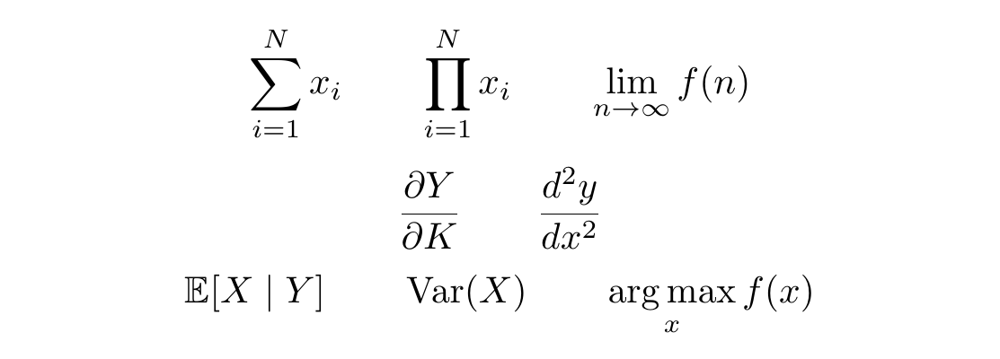
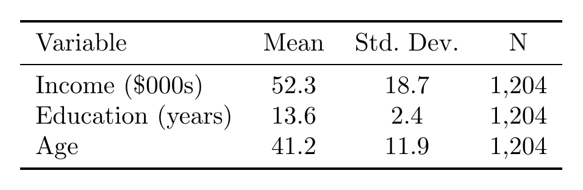
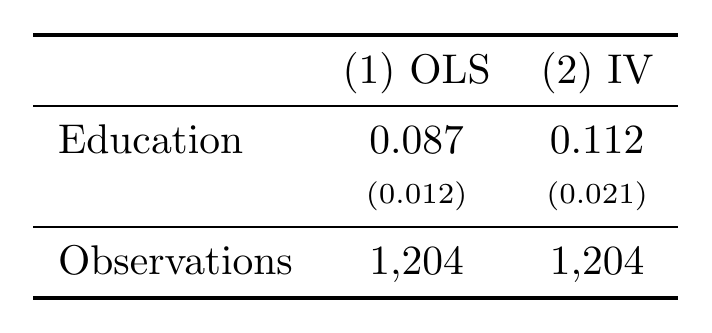
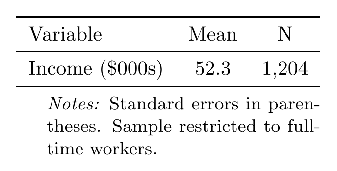
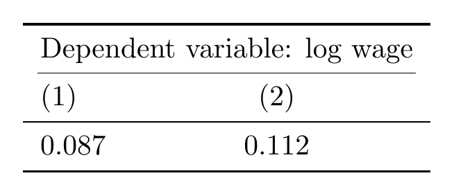
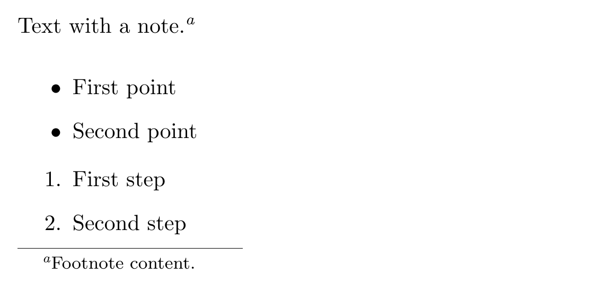
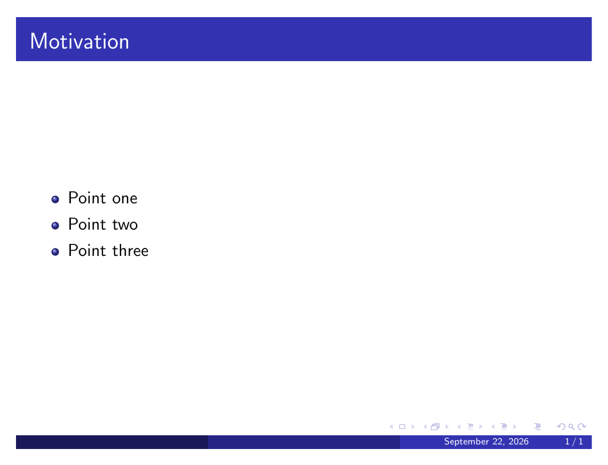

# LaTeX

LaTeX typesets documents from plain-text source instead of a WYSIWYG editor. It is the standard for economics papers, problem sets, and slides because equations, tables, citations, and cross-references stay consistent and reproducible.

## Setup

**Overleaf** (overleaf.com) needs no install — write in the browser, compile in the browser, share a link for collaboration. Best default for coauthored papers.

**Local install** — [TeX Live](https://www.tug.org/texlive/) (Linux/Windows) or [MacTeX](https://www.tug.org/mactex/) (Mac), plus an editor such as VS Code with the LaTeX Workshop extension or TeXstudio. Compile with:

```bash
pdflatex paper.tex
bibtex paper      # or: biber paper
pdflatex paper.tex
pdflatex paper.tex
```

Running `pdflatex` twice (three times with a bibliography) resolves cross-references and citations, which need a prior pass to know page/section numbers.

## Minimal document

```latex
\documentclass[12pt]{article}
\usepackage[margin=1in]{geometry}
\usepackage{amsmath, amssymb}
\usepackage{booktabs}
\usepackage{graphicx}
\usepackage[hidelinks]{hyperref}

\title{Paper Title}
\author{Ethan Brown}
\date{\today}

\begin{document}
\maketitle

\section{Introduction}
Text here.

\end{document}
```

## Equations

Inline math uses `$...$`; a standalone numbered equation uses `equation`:

```latex
The elasticity is $\varepsilon = \frac{\partial \ln Q}{\partial \ln P}$.

\begin{equation}
    Y_i = \alpha + \beta X_i + \varepsilon_i
    \label{eq:ols}
\end{equation}

As shown in equation~\eqref{eq:ols}, ...
```

**Renders as:**


Multi-line derivations align on `=` with `align`:

```latex
\begin{align}
    \pi(q) &= p(q) q - c(q) \\
    \pi'(q) &= p(q) + p'(q) q - c'(q) = 0 \label{eq:foc}
\end{align}
```

**Renders as:**


Use `align*` (or add `\nonumber`) to suppress numbering on a line. A system of equations with one shared brace:

```latex
\begin{align}
    \max_{c_1, c_2} \quad & u(c_1) + \beta u(c_2) \\
    \text{s.t.} \quad & c_1 + \frac{c_2}{1+r} = y_1 + \frac{y_2}{1+r}
\end{align}
```

Common economics notation:

```latex
% Subscripts/superscripts, fractions, sums, limits
\sum_{i=1}^{N} x_i \qquad \prod_{i=1}^{N} x_i \qquad \lim_{n \to \infty} f(n)
\frac{\partial Y}{\partial K} \qquad \frac{d^2 y}{dx^2}

% Expectation, variance, probability operators (define once in the preamble)
\DeclareMathOperator{\E}{\mathbb{E}}
\DeclareMathOperator{\Var}{Var}
\DeclareMathOperator*{\argmax}{arg\,max}
% then: \E[X \mid Y], \Var(X), \argmax_{x} f(x)
```

**Renders as:**



```latex
% Matrices and vectors
\begin{pmatrix} a & b \\ c & d \end{pmatrix}
\mathbf{X}\boldsymbol{\beta} + \boldsymbol{\varepsilon}
```

**Renders as:**


```latex
% Piecewise definitions
f(x) =
\begin{cases}
    1 & \text{if } x \geq 0 \\
    0 & \text{otherwise}
\end{cases}
```

**Renders as:**


Load `amsmath` (and `amssymb` for symbols like `\mathbb{R}`) before using any of the above — plain LaTeX's `eqnarray` is deprecated; use `align` instead.

## Tables

Use `booktabs` for rules (`\toprule`, `\midrule`, `\bottomrule`) instead of `\hline` — it is the field standard and looks cleaner:

```latex
\begin{table}[htbp]
    \centering
    \caption{Summary Statistics}
    \label{tab:summary}
    \begin{tabular}{lccc}
        \toprule
        Variable & Mean & Std.\ Dev. & N \\
        \midrule
        Income (\$000s) & 52.3 & 18.7 & 1{,}204 \\
        Education (years) & 13.6 & 2.4 & 1{,}204 \\
        Age & 41.2 & 11.9 & 1{,}204 \\
        \bottomrule
    \end{tabular}
\end{table}
```

**Renders as:**



Column spec letters: `l`/`c`/`r` for left/center/right, `p{3cm}` for a fixed-width wrapped column. Regression tables typically decimal-align on numbers — use `siunitx`'s `S` column type:

```latex
\usepackage{siunitx}
\sisetup{table-format=1.3, table-number-alignment=center}

\begin{table}[htbp]
    \centering
    \caption{OLS Estimates}
    \label{tab:ols}
    \begin{tabular}{l S S}
        \toprule
        {} & {(1) OLS} & {(2) IV} \\
        \midrule
        Education    & 0.087 & 0.112 \\
        {}           & {\scriptsize(0.012)} & {\scriptsize(0.021)} \\
        \midrule
        Observations & {1{,}204} & {1{,}204} \\
        \bottomrule
    \end{tabular}
\end{table}
```

**Renders as:**



Add source and definition notes below a table with `threeparttable` so the notes' width matches the table, not the page:

```latex
\usepackage{threeparttable}

\begin{table}[htbp]
    \centering
    \caption{Summary Statistics}
    \begin{threeparttable}
    \begin{tabular}{lcc}
        \toprule
        Variable & Mean & N \\
        \midrule
        Income (\$000s) & 52.3 & 1{,}204 \\
        \bottomrule
    \end{tabular}
    \begin{tablenotes}
        \small
        \item \textit{Notes:} Standard errors in parentheses. Sample restricted to full-time workers.
    \end{tablenotes}
    \end{threeparttable}
\end{table}
```

**Renders as:**



A cell spanning multiple columns uses `\multicolumn{n}{alignment}{text}`:

```latex
\multicolumn{2}{c}{Dependent variable: log wage} \\
```

**Renders as:**



For tables generated from Stata or R (`esttab`, `estout`, `modelsummary`, `stargazer`), export directly to a `.tex` fragment and `\input{}` it rather than retyping the table by hand — this keeps the table reproducible from the underlying regression.

## Figures

```latex
\begin{figure}[htbp]
    \centering
    \includegraphics[width=0.8\textwidth]{figures/wage-trend.pdf}
    \caption{Real Wage Growth, 1990--2020}
    \label{fig:wages}
\end{figure}
```

Two figures side by side with `subcaption`:

```latex
\usepackage{subcaption}

\begin{figure}[htbp]
    \centering
    \begin{subfigure}{0.48\textwidth}
        \includegraphics[width=\textwidth]{figures/panel-a.pdf}
        \caption{Panel A}
    \end{subfigure}
    \hfill
    \begin{subfigure}{0.48\textwidth}
        \includegraphics[width=\textwidth]{figures/panel-b.pdf}
        \caption{Panel B}
    \end{subfigure}
    \caption{Combined figure title}
    \label{fig:panels}
\end{figure}
```

Prefer vector formats (PDF, EPS) over PNG/JPG for plots so they stay sharp at any zoom.

## Special formatting

```latex
% Footnotes
Text with a note.\footnote{Footnote content.}

% Cross-references (compile twice to resolve)
See Section~\ref{sec:results} and Table~\ref{tab:ols}.

% Lists
\begin{itemize}
    \item First point
    \item Second point
\end{itemize}

\begin{enumerate}
    \item First step
    \item Second step
\end{enumerate}
```

**Renders as:**



```latex
% Appendix (after \bibliography or \printbibliography)
\appendix
\section{Additional Results}

% Custom shortcut command, defined once in the preamble
\newcommand{\R}{\mathbb{R}}
```

## Bibliography

`biblatex` with the `biber` backend is the modern choice over legacy `natbib`/BibTeX:

```latex
\usepackage[style=authoryear, backend=biber]{biblatex}
\addbibresource{references.bib}

...

As shown in \textcite{card1994minimum}, ... \parencite{angrist2008mostly}

\printbibliography
```

`references.bib` entry:

```bibtex
@article{card1994minimum,
    author  = {Card, David and Krueger, Alan B.},
    title   = {Minimum Wages and Employment},
    journal = {American Economic Review},
    year    = {1994},
    volume  = {84},
    number  = {4},
    pages   = {772--793},
}
```

Compile order is `pdflatex` → `biber` → `pdflatex` → `pdflatex` (see Setup above).

## Beamer slides

```latex
\documentclass{beamer}
\usetheme{Madrid}

\title{Presentation Title}
\author{Ethan Brown}
\date{\today}

\begin{document}

\begin{frame}
    \titlepage
\end{frame}

\begin{frame}{Outline}
    \tableofcontents
\end{frame}

\section{Motivation}
\begin{frame}{Motivation}
    \begin{itemize}
        \item Point one
        \item Point two \pause
        \item Point three (appears after a click)
    \end{itemize}
\end{frame}

\begin{frame}{A Result}
    \begin{equation}
        Y = \alpha + \beta X + \varepsilon
    \end{equation}
\end{frame}

\end{document}
```

**Renders as** (the "Motivation" frame, after the click that reveals all bullets):



## CV template

The `moderncv` or `awesome-cv` packages give a formatted academic CV out of the box:

```latex
\documentclass[11pt,a4paper,sans]{moderncv}
\moderncvstyle{classic}
\name{Ethan}{Brown}
\title{Economist}
\email{ebrown@example.edu}

\begin{document}
\makecvtitle

\section{Education}
\cventry{2022--2026}{Ph.D. in Economics}{University Name}{City}{}{}

\section{Publications}
\nocite{*}
\printbibliography

\end{document}
```

## Next topics

- Custom document classes for journal submission requirements
- `pgfplots`/`tikz` for figures generated directly in LaTeX
- Multi-file projects with `\input`/`\include`
- Version-controlling `.tex` files alongside `.bib` and figures
